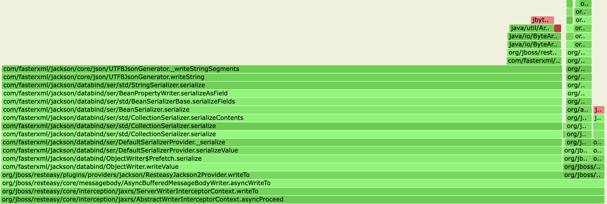
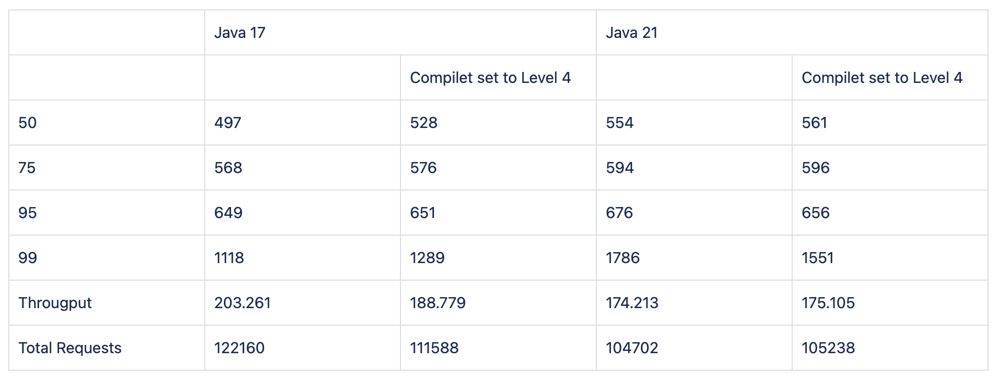

## JDK 21 performance degradation reproducer

We have performed performance testing with a build between  java 17 and  java 21. From the  results we have observed the degradation in JDK21 for a particular scenario which is writing a high payload in async mode.

```
5-10-100000-Async [5 down stream calls , 10 ms delay, 100000 byte data]
    Metric             Current(ms)    Baseline(ms)         Variance      Tolerance
    50% Line                 137.0           120.0           14.2 %          1.0 %
    75% Line                 179.0           153.0           17.0 %          1.0 %
    95% Line                 261.0           215.0           21.4 %          1.0 %
    99% Line                 342.0           301.0           13.6 %          2.0 %
    Mean                     148.0           128.0           15.6 %          1.0 %
    Throughput               637.0           745.2          -14.5 %         -5.0 %
```

Based on the GC logs, CPU profiling flame graphs
1. We dont see any issue with the GC. we see the pause time, allocation rate is less since the load is reduced.
2. We see the CPU spent more time in `com/fasterxml/jackson/core/json/UTF8JsonGenerator._writeStringSegments` also the CPU usage is increased even though the load is reduced.
   
4. Also we were able to reproduce the degradation only when we **use the servers inside a container**.  Plain java application is not reproducing the issue.

The scenario the reproducer aims to reproduce is,


***Async Endpoint (Tomcat) -[Async endpoint calls RN server]-> -> Reactor Netty endpoint -[responds with the same playload with a 10 ms delay] -> Async Endpoint (Tomcat) [Back to tomcat main server responds with the bulk data ~500kb asynchronously]***

### How to execute the reproducer?

1. Build java 17, 21 images for the reproducer - use the /java17/Dockerfile or   /java21/Dockerfile to build the docker image. (update the paths wherever needed)
2. Prepare the docker-compose by updating the right images for 17 and 21 respectively.
3. Bring the containers `docker-compose -f docker-compose.yml -f docker-compose-host-network.yml up`
4. Run the load test using the gatling setup available in the reproducer

   ```shell  
   mvn -Dgatling.simulationClass=LoadTester -Dhost=localhost -Dport=8080 -Dsecure=false -Dduration=300 -Duser=100 gatling:test  
   ```



Based on this what we can see is the java 17 is getting degraded when we set the compiler level to 4. But jdk 21 does not responds in the same way.


*Based on chat gpt response on JIT logs* :

More aggressive speculative optimizations in Java 21, as reflected by the % log entries.

Faster deoptimization in Java 21, where methods are more rapidly marked as "not entrant" after speculative or failed optimizations.

Higher frequency of recompilation in Java 21 for performance-critical methods, likely due to enhanced profiling and feedback mechanisms.

Improved overall performance tuning in Java 21 as seen by the JVM's faster adjustment to runtime execution patterns.


